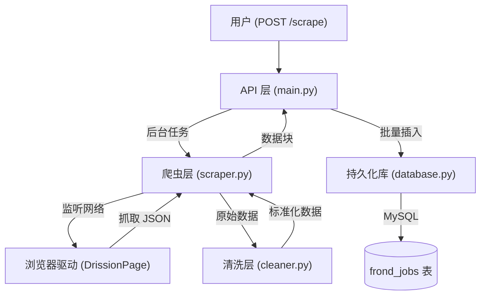

# Boss Zhipin Scraper 项目全景图 (Project Panorama)

本仓库是一个基于 **FastAPI** 和 **DrissionPage** 开发的 Boss 直聘职位数据爬取系统。它不仅能抓取数据，还包含完整的数据清洗、标准化以及数据库持久化流程
---

## 1. 核心架构视图

项目采用经典的**分层式架构**，解耦了网络交互、业务逻辑和数据存储：

---

## 2. 模块职责详解

| 模块 | 文件 | 主要职责 |
| :--- | :--- | :--- |
| **入口逻辑** | [main.py](file:///e:/EMS/drissionPage/main.py) | 启动 FastAPI 服务，定义 API 接口，管理异步后台任务。 |
| **核心爬虫** | [scraper.py](file:///e:/EMS/drissionPage/scraper.py) | 控制浏览器动作（搜索、滚动）、监听网络包捕获 `joblist.json`。 |
| **数据清洗** | [cleaner.py](file:///e:/EMS/drissionPage/cleaner.py) | 使用正则表达式处理复杂的薪资（如 '15-25K·14薪'）和经验字段。 |
| **数据存储** | [database.py](file:///e:/EMS/drissionPage/database.py) | 封装 PyMySQL 操作，处理 `INSERT ... ON DUPLICATE KEY UPDATE`。 |
| **配置中心** | [config.py](file:///e:/EMS/drissionPage/config.py) | 管理数据库连接信息、浏览器端口等配置。 |

---

## 3. 关键技术亮点

- **DrissionPage 监听模式**：不同于传统的 HTML 解析，本项目直接监听浏览器发出的 API 请求包 (`listen.wait()`)，获取的是原始 JSON 数据，准确率和效率极高且不易被屏蔽。
- **异步后台任务**：使用 FastAPI 的 `BackgroundTasks`，用户发起抓取请求后立即返回结果，爬虫在后台静默运行。
- **流式处理 (Generator)**：爬虫通过 `yield` 分批返回数据块，避免一次性加载过多数据导致内存溢出。
- **数据标准化**：在存入数据库前，将薪资范围、工作经验等字符串统一转化为数值（min/max/avg），方便后续数据分析。

---

## 4. 源码阅读规划 (推荐顺序)

为了最高效地理解本项目，建议按照以下路径阅读：

### 第一步：理解全局配置与入口 (The Entry)

1. **[config.py](file:///e:/EMS/drissionPage/config.py)**: 了解项目依赖的基础环境。
2. **[main.py](file:///e:/EMS/drissionPage/main.py)**: 看看 [trigger_scrape](file:///e:/EMS/drissionPage/main.py#40-47) 是如何被调用的，以及它如何调度 [run_scraper_task](file:///e:/EMS/drissionPage/main.py#22-39)。

### 第二步：深入采集核心 (The Scraper)

1. **[scraper.py](file:///e:/EMS/drissionPage/scraper.py)**: 这是项目的“心脏”。重点观察 [scrape_keyword](file:///e:/EMS/drissionPage/scraper.py#21-110) 方法中的 `page.listen` 逻辑，这是 DrissionPage 的精华。

### 第三步：学习数据处理 (The Cleaner)

1. **[cleaner.py](file:///e:/EMS/drissionPage/cleaner.py)**: 观察如何利用正则表达式 (`re`) 将凌乱的网页文本转化为结构化字段。

### 第四步：掌握持久化 (The Storage)

1. **[database.py](file:///e:/EMS/drissionPage/database.py)**: 学习如何处理数据库幂等性（重复 ID 更新逻辑）。

---

## 5. 如何快速开始学习？

> [!TIP]
>
> 1. 打开 Chrome 浏览器并启用远程调试模式（通常是 `--remote-debugging-port=9222`）。
> 2. 运行 `python main.py`。
> 3. 使用 API 测试工具（如 Postman 或 cURL）向 `http://localhost:8001/scrape` 发送一个 JSON：`{"keyword": "Java", "pages": 2}`。
> 4. 在控制台观察日志，看看 [scraper.py](file:///e:/EMS/drissionPage/scraper.py) 是如何一步步处理数据的。
